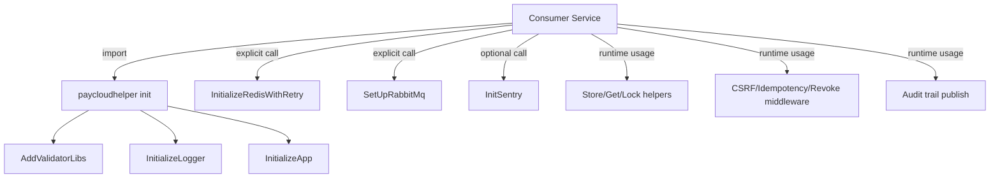
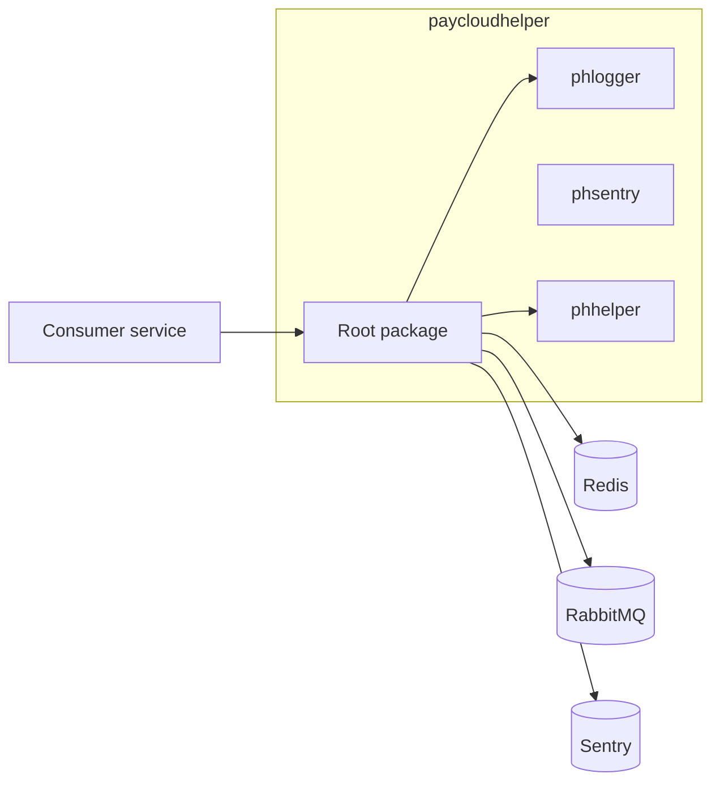

# paycloudhelper

**Go shared library** — common utilities for all PayCloud Hub microservices.

---

**Version:** 2.1.0
**Go Version:** 1.25.0 (toolchain: go1.25.9)
**Last Updated:** April 25, 2026

Module: `github.com/PayCloud-ID/paycloudhelper`  
Go: 1.25 (toolchain pinned via `go.mod`)

---

## Table of Contents

- [Overview](#overview)
- [Architecture](#architecture)
- [Quick Start](#quick-start)
- [Package Structure](#package-structure)
- [API Reference](#api-reference)
- [Integrations](#integrations)
- [Configuration](#configuration)
- [Testing](#testing)
- [Verifying the library](#verifying-the-library)
- [Consumer Migration (v2.0.0 / Redis v9)](#consumer-migration-v200--redis-v9)
- [CI (Bitbucket Pipelines)](#ci-bitbucket-pipelines)
- [Versioning](#versioning)
- [Automation Prompts](#automation-prompts)
- [Contributing](#contributing)

---

## Overview

`paycloudhelper` is a **shared library** imported by ~30 PayCloud microservices. It is **not a standalone service**. On import, `init()` runs automatically and bootstraps the logger and app identity. Consumer services then explicitly opt into Redis, RabbitMQ, and Sentry.

### Auto-Initialization Flow

```
import paycloudhelper → init() runs:
  AddValidatorLibs() → InitializeLogger() → InitializeApp()

Consumer must explicitly call:
  InitializeRedisWithRetry(opts)   → Redis pool + RedSync
  SetUpRabbitMq(...)               → Audit trail
  InitSentry(options)              → Error tracking (optional)
  ConfigureLogForwarding(cfg)      → Log → Sentry forwarding (optional)
```

---

## Architecture

### Service Flow



### Integration Map



---

## Quick Start

```go
import pch "github.com/PayCloud-ID/paycloudhelper"

// In main() — after godotenv.Load()
pch.InitializeRedisWithRetry(pch.RedisInitOptions{...})
pch.SetUpRabbitMq(...)
pch.InitSentry(pch.SentryOptions{Dsn: os.Getenv("SENTRY_DSN")})

// Optional: forward Fatal logs to Sentry automatically
pch.ConfigureLogForwarding(pch.LogForwardConfig{
    ForwardFatal: true, // default true when Sentry is enabled
})
```

---

## Package Structure


| Package                | Path                    | Purpose                                                                                                       |
| ---------------------- | ----------------------- | ------------------------------------------------------------------------------------------------------------- |
| Root                   | `.`                     | Public API — all below re-exported here                                                                       |
| `phlogger`             | `phlogger/`             | Logger wrapper (`kataras/golog`) + sampler + context logger + metrics hooks + KeyedLimiter + forwarding hooks |
| `phsentry`             | `phsentry/`             | Sentry error tracking, log receiver                                                                           |
| `phhelper`             | `phhelper/`             | Global state (`APP_NAME`, `APP_ENV`), JSON/string helpers                                                     |
| `phaudittrailv0`       | `phaudittrailv0/`       | Legacy v0 audit trail (RabbitMQ)                                                                              |
| `phjson`               | `phjson/`               | Sonic JSON wrapper for high-throughput consumers                                                              |
| `sdk/services/s3minio` | `sdk/services/s3minio/` | Service-scoped S3MinIO SDK (helper, grpc, http bridge, pb, proto, facade)                                     |
| `sdk/shared`           | `sdk/shared/`           | Shared runtime placeholders for transport, observability, and error normalization across future SDKs          |


### Service-Scoped SDK Foundation

`sdk/services/s3minio` is the active runtime path and reference layout for future service SDKs.

- All S3MinIO helper/grpc/http/pb logic now lives under `sdk/services/s3minio/*`.
- New services should follow the same `sdk/services/<service>` structure.
- Governance scripts under `scripts/proto/` and `scripts/check-*.sh` enforce drift and transport boundaries.

---

## API Reference

### Logging

Import the root package (e.g. `import pch "github.com/PayCloud-ID/paycloudhelper"`). **Do not import `phlogger` directly in consumer services.** Every log line must include the caller in square brackets: use `[Type.MethodName]` for methods (e.g. `[Server.Start]`) and `[FuncName]` for plain functions. Prefer key=value style after the prefix.

```go
pch.LogI("[FuncName] started id=%s", id)    // Info — or [Server.Start] for methods
pch.LogE("[FuncName] error: %v", err)        // Error
pch.LogW("[FuncName] warn: %s", msg)         // Warning
pch.LogD("[FuncName] debug key=%s", key)     // Debug (off in production)
pch.LogF("[FuncName] fatal: %v", err)        // Fatal — process exits
pch.LogJ(obj)                                // JSON (compact)
pch.LogJI(obj)                               // JSON (indented)
pch.LogErr(err)                              // Error shorthand (no format string)
```

#### Sampled Logging (Default Behavior)

All log functions (`LogI`, `LogE`, `LogW`, `LogD`, `LogF`) are **sampled by default** using the format string as key. The sampler uses an **Initial/Thereafter** pattern per time period:


| Environment                | Initial      | Thereafter | Period | Behavior                             |
| -------------------------- | ------------ | ---------- | ------ | ------------------------------------ |
| `production` / `prod`      | 5            | 50         | 1s     | First 5/sec per key, then every 50th |
| `staging` / `stg`          | 10           | 10         | 1s     | First 10/sec, then every 10th        |
| `develop` / `""` (default) | 0 (disabled) | —          | —      | All logs pass through                |


The sampler is initialized automatically from `APP_ENV`. Override at startup:

```go
pch.InitializeSampler(pch.SamplerConfig{
    Initial:    3,
    Thereafter: 100,
    Period:     time.Second,
})
```

When suppressed logs are emitted, the message includes `[+N suppressed]`.

#### Sampled Logging with Custom Key

```go
// Custom key isolates sampling from the format string.
// Uses the global sampler config (env-aware):
pch.LogIRated("cache.miss", "[FuncName] cache miss key=%s", key)
pch.LogERated("db.error", "[FuncName] db error: %v", err)

// Explicit time-window override (bypasses sampler, uses simple dedup):
pch.LogIRatedW("cache.miss", 5*time.Second, "[FuncName] cache miss key=%s", key)
pch.LogERatedW("db.error", 500*time.Millisecond, "[FuncName] db error: %v", err)
```

#### Context Logger (Request-Scoped Fields)

`LogContext` is a child logger that prepends key-value fields to every message.
Useful for request-scoped or operation-scoped logging:

```go
ctx := pch.NewLogContext("req_id", "abc-123", "merchant", "M001")
ctx.LogI("processing payment amount=%d", 5000)
// output: [req_id=abc-123 merchant=M001] processing payment amount=5000

ctx.LogE("payment failed: %v", err)
// output: [req_id=abc-123 merchant=M001] payment failed: timeout

// Add more fields without losing parent context:
child := ctx.With("step", "validate")
child.LogI("checking input")
// output: [req_id=abc-123 merchant=M001 step=validate] checking input
```

#### Metrics Hooks (High-Frequency Events)

For events that happen thousands of times per second, measure instead of logging.
Register a hook once at startup — no prometheus dependency in the library:

```go
// Wire your own counter backend (prometheus, statsd, etc.)
pch.RegisterMetricsHook(func(event string, count int64) {
    myPromCounter.WithLabelValues(event).Add(float64(count))
})

// Then in hot paths:
pch.IncrementMetric("cache.miss")
pch.IncrementMetricBy("batch.processed", int64(batchSize))
```

If no hook is registered, calls are no-ops (zero overhead).

#### KeyedLimiter (Token Bucket)

For precise per-key rate control (max N events/sec), use `KeyedLimiter` instead of the sampler:

```go
limiter := pch.NewKeyedLimiter(10, 1)  // 10 events/sec, burst 1

if limiter.Allow("db.timeout") {
    pch.LogE("[Handler] database timeout host=%s", host)
}
```

Each key gets an independent token bucket. Tokens refill at the configured rate.

#### Sentry Structured Logging

Paycloudhelper integrates **structured logging with Sentry** (SDK v0.33.0+) to forward all logs to Sentry for centralized error tracking and observability.

**Simple Setup (Recommended):**

```go
// 1. Initialize Sentry
pch.InitSentry(pch.SentryOptions{
    Dsn:         os.Getenv("SENTRY_DSN"),
    Environment: os.Getenv("APP_ENV"),
    Release:     os.Getenv("SENTRY_RELEASE"),
})

// 2. Enable structured logging via environment variable (one-liner)
pch.ConfigureSentryLogging(pch.SentryLoggingFromEnv())

// 3. Logs are now automatically forwarded to Sentry
pch.LogE("[Main.start] error: %v", err)     // → Sentry exception event
pch.LogI("[Main.start] listening on :8080") // → Sentry breadcrumb
```

**Environment Variables:**


| Env Var          | Default | Effect                                                                                                                                                   |
| ---------------- | ------- | -------------------------------------------------------------------------------------------------------------------------------------------------------- |
| `SENTRY_LOGGING` | `false` | Enable/disable structured logging to Sentry. Accepts: `true`, `1`, `t`, `T`, `false`, `0`, `f`, `F` (case-insensitive). Invalid values default to false. |
| `SENTRY_DSN`     | empty   | Sentry ingestion endpoint                                                                                                                                |
| `SENTRY_RELEASE` | empty   | Application version                                                                                                                                      |
| `SENTRY_DEBUG`   | `false` | Verbose SDK diagnostics (local/staging only)                                                                                                             |


**How It Works:**

- All logs via `LogI()`, `LogE()`, `LogW()`, `LogD()`, `LogF()` are forwarded to Sentry
- Error/fatal logs → exception events (appear as issues in Sentry)
- Info/warn/debug logs → breadcrumbs (appear as context in related issues)
- `[FunctionName]` prefix is extracted for issue grouping
- Thread-safe: hooks are registered synchronously once

**Advanced: Granular Control**

For more granular per-level configuration (legacy):

```go
pch.ConfigureLogForwarding(pch.LogForwardConfig{
    ForwardFatal: true,  // default: true
    ForwardError: true,  // default: false  
    ForwardWarn:  false, // default: false
    ForwardInfo: false,  // default: false
    // OR autoload: pch.LogForwardConfigFromEnv()
})
```

**Before Process Exit:**

```go
pch.FlushSentry(2 * time.Second) // Ensure events are delivered
```

### Response

```go
var resp pch.ResponseApi
resp.Success("ok", data)            // 200
resp.Accepted(data)                 // 202
resp.BadRequest("msg", "ERR_CODE")  // 400
resp.Unauthorized("msg", "")        // 401
resp.InternalServerError(err)       // 500
return c.JSON(resp.Code, resp)
```

### Redis

```go
pch.StoreRedis(key, value, duration)
pch.GetRedis(key)
pch.StoreRedisWithLock(key, value, duration)
pch.AcquireLockWithRetry(key, ttl, retries, delay)
pch.ReleaseLockWithRetry(mutex, retries)
```

### Sentry Error Tracking

Initialize Sentry for error tracking. A non-empty `Dsn` is required; an empty DSN skips initialization.

**For structured logging integration**, see [Sentry Structured Logging](#sentry-structured-logging) above.

`**Debug` and `SENTRY_DEBUG`:** This only controls SDK internal diagnostics verbosity, not structured logging. When `Debug` is `true`, the sentry-go SDK prints verbose diagnostics to the configured `DebugWriter` (default: application logs with `[pchelper.Sentry]` prefix).


| Deploy context                 | Typical `Debug` value                                           |
| ------------------------------ | --------------------------------------------------------------- |
| Local / active troubleshooting | `true` only while fixing DSN, network, or “events not arriving” |
| Staging                        | Usually `false`; `true` briefly if you are debugging the SDK    |
| Production                     | `false` (less noise and log volume)                             |


```go
pch.InitSentry(pch.SentryOptions{
    Dsn:         os.Getenv("SENTRY_DSN"),
    Environment: os.Getenv("APP_ENV"),
    Release:     os.Getenv("SENTRY_RELEASE"),
    Debug:       os.Getenv("SENTRY_DEBUG") == "true",
})
pch.SendSentryError(err)
pch.SendSentryMessage("something happened")
pch.FlushSentry(2 * time.Second) // before process exit
```

### S3MinIO Service SDK (`sdk/services/s3minio/helper`)

The service-scoped helper centralizes repeated request-building and response-validation logic.
It is transport-neutral and used by both gRPC and HTTP bridge adapters in the same SDK namespace.

```go
import s3helper "github.com/PayCloud-ID/paycloudhelper/sdk/services/s3minio/helper"

// Adapter implements s3helper.Downloader by mapping to local gRPC client code.
type Adapter struct{}

func (a Adapter) Download(ctx context.Context, req *s3helper.DownloadRequest) (*s3helper.DownloadResponse, error) {
    // map req to service-specific protobuf request and call downstream client
    return &s3helper.DownloadResponse{Code: s3helper.CodeOK, Data: "https://..."}, nil
}

url, err := s3helper.GetPresignedURL(ctx, Adapter{}, "file.pdf", userID, merchantID, "path", "bucket", 300)
```

Available helpers:

- `BuildDownloadRequest`
- `BuildUploadRequestForMultipart`
- `BuildUploadRequestForFile`
- `GetPresignedURL`
- `UploadByMultipart`
- `UploadByFile`
- `UploadByRequest`

### Audit Trail

**V1 — goroutine-per-call** (legacy, still supported):

```go
client := pch.SetUpRabbitMq(host, port, vhost, user, pass, queue, appName)
pch.LogAudittrailData(funcName, desc, source, commType, &keys, &reqResp)
pch.LogAudittrailProcess(funcName, desc, info, &keys)
```

- `Push()` retries up to `PushMaxRetries` (3) with `PushTimeout` (15s).
- Nil client / not-ready → early exit with rate-limited warning.
- Atomic counter IDs prevent collision under high throughput.

**V2 — worker pool with circuit breaker** (recommended for new services):

```go
pub := pch.SetUpAuditTrailPublisher(host, port, vhost, user, pass, queue, appName,
    pch.WithWorkerCount(10),
    pch.WithBufferSize(1000),
    pch.WithMessageTTL("60000"),
)
pch.LogAudittrailDataV2(funcName, desc, source, commType, &keys, &reqResp)
pch.LogAudittrailProcessV2(funcName, desc, info, &keys)

// Lifecycle
pub.Stop() // graceful drain on shutdown
```

- Bounded worker pool (default 10 workers, 1000 buffer).
- Circuit breaker: trips after 10 consecutive failures, 30s cooldown.
- Falls back to V1 goroutine-per-call when publisher is nil.
- Functional options: `WithWorkerCount`, `WithBufferSize`, `WithMaxRetries`, `WithPublishTimeout`, `WithMessageTTL`, `WithCircuitBreakerThreshold`, `WithCircuitBreakerCooldown`.

### Middleware (Echo)

```go
e.Use(pch.VerifCsrf)       // X-Xsrf-Token validation
e.Use(pch.VerifIdemKey)    // Idempotency-Key deduplication
e.Use(pch.RevokeToken)     // JWT + Redis revocation check
```

---

## Integrations

### Redis

- **Purpose:** caching, idempotency, token revoke checks, distributed locks.
- **Connection:** provided by consumer service config and initialized through `InitializeRedisWithRetry`.
- **Key operations:** `StoreRedis`, `GetRedis`, `DeleteRedis`, `AcquireLockWithRetry`, `ReleaseLockWithRetry`.

### RabbitMQ

- **Purpose:** publish audit trail payloads (v1 and v2 publisher modes).
- **Connection:** set through `SetUpRabbitMq` or v2 publisher setup APIs.
- **Key operations:** process/data audit log publishing with retry and backpressure controls.

### Sentry

- **Purpose:** exception capture and optional structured log forwarding.
- **Connection:** `InitSentry` with DSN/environment/release options.
- **Key operations:** panic/error forwarding, breadcrumb stream from logger hooks.

## Configuration

All configuration is loaded from environment variables in `InitializeApp()`:


| Var                              | Required   | Default     | Purpose                                                                                                                                                    |
| -------------------------------- | ---------- | ----------- | ---------------------------------------------------------------------------------------------------------------------------------------------------------- |
| `APP_NAME`                       | Yes        | `""`        | Service name (used in Sentry, logs)                                                                                                                        |
| `APP_ENV`                        | Yes        | `""`        | `develop` / `staging` / `production`                                                                                                                       |
| `REDIS_HOST`                     | For Redis  | `""`        | Redis server                                                                                                                                               |
| `REDIS_PORT`                     | For Redis  | `6379`      | Redis port                                                                                                                                                 |
| `REDIS_PASSWORD`                 | No         | `""`        | Redis auth                                                                                                                                                 |
| `SENTRY_DSN`                     | For Sentry | `""`        | Sentry project DSN (validated in `InitializeApp`; empty disables Sentry)                                                                                   |
| `SENTRY_LOGGING`                 | No         | `false`     | Enable structured logging to Sentry (all log levels)                                                                                                       |
| `SENTRY_DEBUG`                   | No         | `false`     | **Not read by this library.** Services pass `Debug: os.Getenv("SENTRY_DEBUG") == "true"` into `InitSentry` if desired; controls SDK diagnostics verbosity. |
| `LOG_FORWARD_FATAL`              | No         | `true`      | Forward Fatal → Sentry (legacy; use `SENTRY_LOGGING` instead)                                                                                              |
| `LOG_FORWARD_ERROR`              | No         | `true`      | Forward Error → Sentry (legacy; use `SENTRY_LOGGING` instead)                                                                                              |
| `LOG_FORWARD_WARN`               | No         | `false`     | Forward Warn → Sentry (legacy; use `SENTRY_LOGGING` instead)                                                                                               |
| `LOG_FORWARD_INFO`               | No         | `false`     | Forward Info → Sentry (legacy; use `SENTRY_LOGGING` instead)                                                                                               |
| `TRANSACTION_REDIS_LOCK_TIMEOUT` | No         | `2000` (ms) | Distributed lock TTL                                                                                                                                       |
| `TRANSACTION_REDIS_BACKOFF`      | No         | `10` (ms)   | Lock retry backoff                                                                                                                                         |


---

## Testing

Unit tests cover helpers, headers, configuration, response handling, Redis options/mutex/LockError, init/app env, validator rules, and subpackages (`phhelper`, `phjson`, `phlogger`, `phsentry`). Integration tests for Redis and middleware are skipped by default (require Redis/Echo).

### Run all tests (from repo root)

```bash
./scripts/run_tests.sh
```

**Options:**


| Option            | Description                                                       |
| ----------------- | ----------------------------------------------------------------- |
| `-v`, `--verbose` | Verbose test output                                               |
| `-race`           | Run with race detector (required for concurrency-related changes) |
| `-cover`          | Print coverage per package                                        |
| `-coverprofile`   | Write `coverage.out` and print `go tool cover -func` summary      |
| `-short`          | Skip long-running tests                                           |
| `-h`, `--help`    | Show usage                                                        |


**Examples:**

```bash
./scripts/run_tests.sh -v
./scripts/run_tests.sh -race
./scripts/run_tests.sh -coverprofile
go tool cover -html=coverage.out   # open HTML report (after -coverprofile)
```

**Makefile (short tests + merged coverage):**

```bash
make test-go                 # go test -short ./...
make test-coverage           # merged -coverpkg=$(COVERAGE_PKGS)
make coverage-inventory      # coverage.out + coverage-func.txt + summary (same -coverpkg defaults)
make test-coverage-check     # fail if merged total < COVERAGE_MIN (default 65; goal 90%)
make test-coverage-check COVERAGE_MIN=90   # enforce 90% when the suite is ready
make test-coverage-integration   # optional: same merged -coverpkg without -short
```

`COVERAGE_PKGS` defaults to all packages from `go list ./...` **except** `phaudittrailv0` (legacy dial-heavy) and `**sdk/shared/*`** (doc-only placeholder packages). Use `COVERAGE_PKGS=./...` to include everything in the merged profile.

**Without the script:**

```bash
go test ./...
go test ./... -race
go test ./... -cover
go test ./... -coverprofile=coverage.out -covermode=atomic
```

**Makefile / `run.sh`:** targets mirror CI (`build`, `vet`, `test`) plus `test-race`, `test-cover`, and `deps`. For this repo (library, no `main`), `./run.sh` runs `go test -race ./...`. Regenerate or adapt for other layouts:

```bash
make help
./scripts/generate-makefile.sh [--service-path DIR] [--dry-run]
```

### Code quality

- **Lint:** `go vet ./...`
- **Build:** `go build ./...`
- Tests follow Go testing conventions, table-driven where appropriate, with clear names and edge-case coverage. Integration-heavy code (AMQP, audit trail, health checks, Echo middleware) is covered by integration tests when Redis/services are available.

---

## Verifying the library

To confirm the library is working correctly and all tested behaviour passes:

1. **Build** — compiles without errors:
  ```bash
   go build ./...
  ```
2. **Vet** — no suspicious constructs:
  ```bash
   go vet ./...
  ```
3. **Tests** — all unit tests pass:
  ```bash
   go test ./...
  ```
4. **Race detector** (recommended for concurrency-related changes):
  ```bash
   go test -race ./...
  ```

One-liner from repo root:

```bash
go build ./... && go vet ./... && go test ./...
```

Or use the script: `./scripts/run_tests.sh` (add `-race` for race detection).

---

## Consumer Migration (v2.0.0 / Redis v9)

`paycloudhelper` v2.0.0 introduces a major dependency alignment on `github.com/redis/go-redis/v9`.
Consumer services should treat this as a coordinated migration, not only a module bump.

### Migration Checklist for Consumer Services

1. Update module dependency:
   ```bash
   go get github.com/PayCloud-ID/paycloudhelper@v2.0.0
   go mod tidy
   ```
2. Replace direct Redis imports from `github.com/go-redis/redis/v8` to `github.com/redis/go-redis/v9`.
3. Keep startup initialization through `InitializeRedisWithRetry` and preserve key naming conventions.
4. Re-run service validation gates:
   - `go build ./...`
   - `go vet ./...`
   - `go test ./...`
   - `go test -race ./...`

### Migration Skills for Services

Use these skill packs from this repository as migration playbooks:

- `.agents/skills/redis-v9-consumer-migration-core/`
- `.agents/skills/redis-v9-consumer-migration-echo-api/`
- `.agents/skills/redis-v9-consumer-migration-worker/`
- `.agents/skills/redis-v9-consumer-migration-scheduler/`

---

## CI (Bitbucket Pipelines)

Every push to **develop** and **main** runs a pipeline that:

- Builds the module (`go build ./...`)
- Runs the linter (`go vet ./...`)
- Runs all unit tests (`go test ./...`)

If any step fails, the pipeline fails. Fix the code and push again.

**Note:** Pipelines run *after* the push. The push itself is not blocked. To keep **main** (or **develop**) from accepting broken code:

1. In Bitbucket: **Repository settings → Branch restrictions**.
2. Add a restriction for `main` (and optionally `develop`): **Require passing pipelines** (and/or require pull requests). Then merges to that branch only succeed when the pipeline is green.

Pipeline config: `bitbucket-pipelines.yml` in the repo root.

---

## Versioning


| Bump      | When                                                          |
| --------- | ------------------------------------------------------------- |
| **PATCH** | Bug fixes, zero behavior change                               |
| **MINOR** | New backward-compatible features                              |
| **MAJOR** | Breaking changes — requires coordinating all consumer updates |


---

## S3MinIO Shared SDK Workflow

Use a single canonical provider proto and regenerate shared helper SDK packages in this repository.

1. Edit canonical proto in `paycloud-be-s3minio-manager/proto/s3minio.proto`.
2. Run `./scripts/proto/update-s3minio-proto.sh` from paycloudhelper.
3. Run `./scripts/proto/gen-s3minio-client.sh` to regenerate and test helper packages.
4. Optionally run `./scripts/proto/check-stub-drift.sh` in CI or before release.
5. Release paycloudhelper and bump consumer service dependencies.

Governance check for direct internal HTTP usage:

```bash
./scripts/check-no-direct-s3minio-http.sh
```

Design and rollout references are stored in `docs/sdk/`.

Scaffold a future service SDK with:

```bash
make proto.service.scaffold SERVICE=clientpg
```

---

## Automation Prompts

- `prompt-migrate-bitbucket-pipelines-to-github-actions.md`
  - Reads `bitbucket-pipelines.yml` and generates an equivalent GitHub Actions workflow.
  - Preserves build/vet/test/coverage gates and branch triggers.

## Contributing

1. `git checkout -b feat/your-feature`
2. Write failing test first (TDD)
3. Implement minimal code
4. `go test -race ./...` — must pass
5. `go build ./...` — must pass
6. `git tag vX.Y.Z` when ready to release

See `.agents/rules/` and `AGENTS.md` for full development rules.